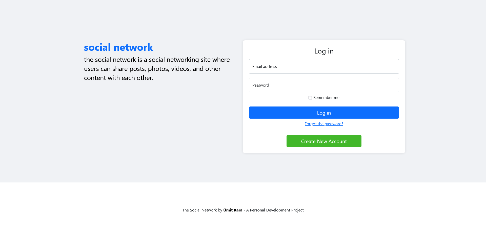
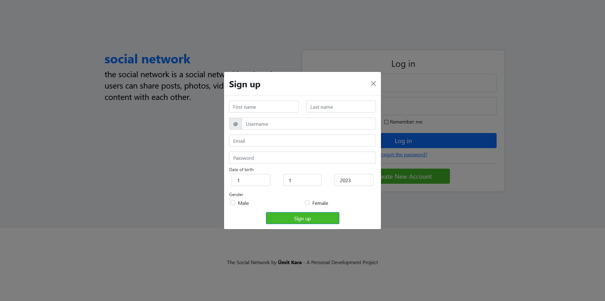
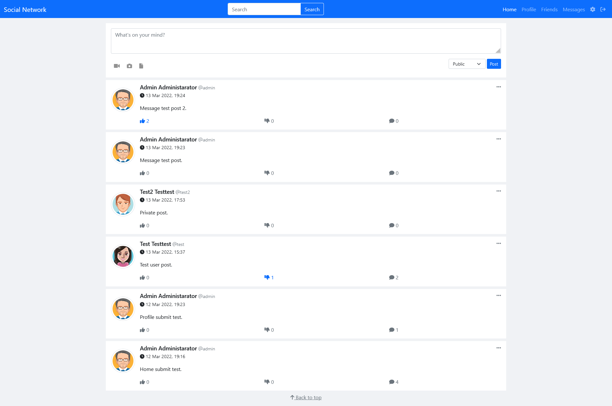
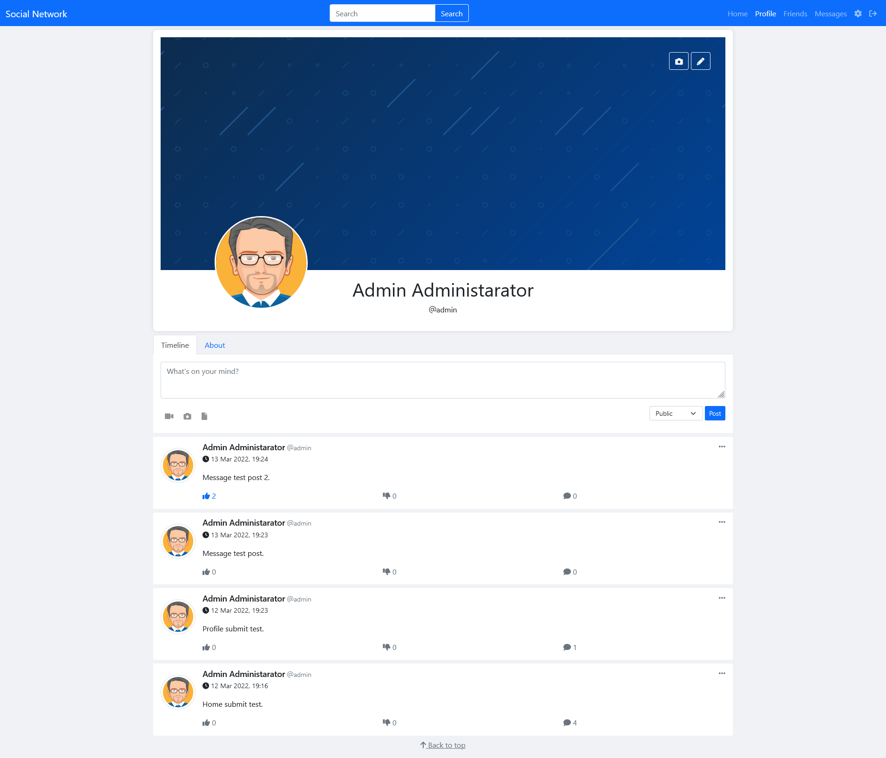
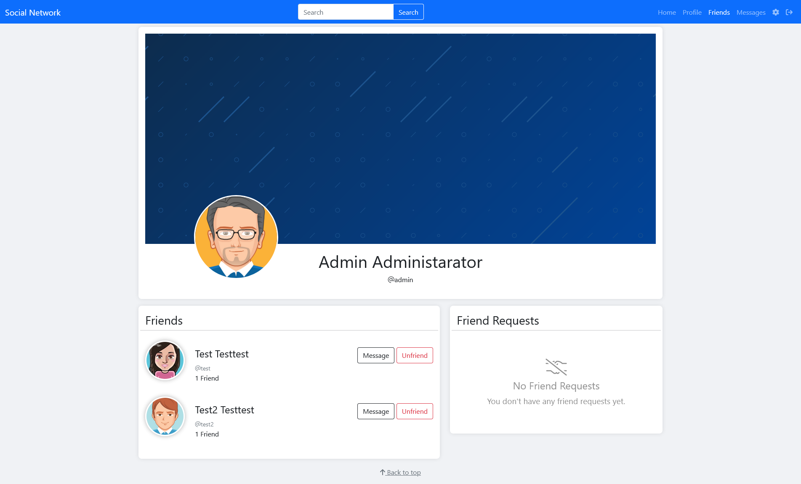
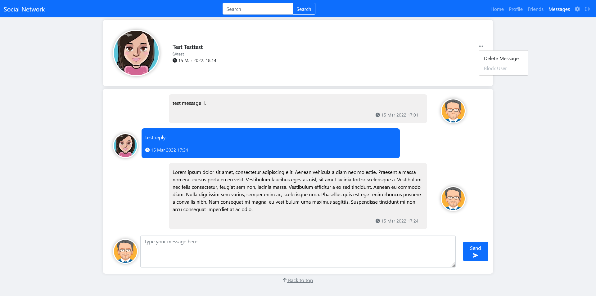
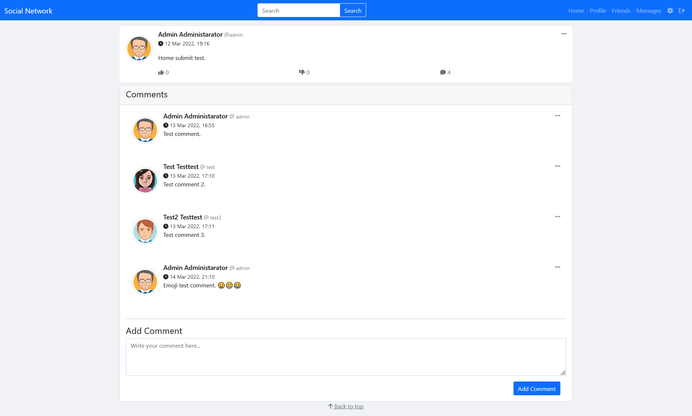

# Social Network

### **A personal development project**
 

This is a personal development project to learn Django and improve HTML/CSS/JS skills. This project is a Facebook clone. I used Bootstrap for the front-end. No realtime communication(*Django Signal, WebSocket*) is implemented, so when you post, like, comment or message the page needs to be refreshed to see the changes. The project is still in development, so if you have any suggestions or comments, please feel free to contact me. Also post attachemnts not work properly for now.
  

---

### **Here are some screenshots**
 

Landing Screen:

Signup:

Homepage:

Profile:

Friends:

Messages:

Post Details:

